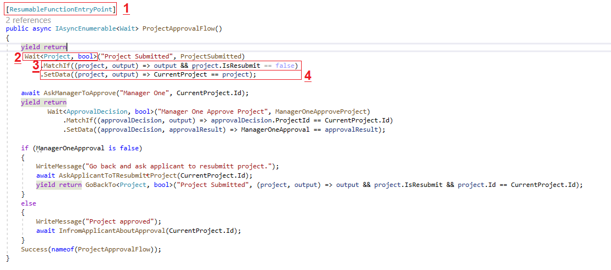

**Project Status: Work in progress**

# What is Resumable Function?
A function/method/procedure/routine that pauses and resumes execution based on external events that it waits for.
# Code example 

Number in image illustration:
1. Line one: Mark a method with `[ResumableFunctionEntryPoint]` to indicate that the method paused and resumed based on waits inside
2. LineTwo: Wait for the `ProjectSubmitted` method to be executed, this call will save an object representing the wait in the database (Wait Record) and pause the method execution until `ProjectSubmitted` method called.
3. We pass an expression tree `(project, output) => output && project.IsResubmit == false` that will be evaluated when `ProjectSubmitted` method called to check if it is a match for the current instance or not, The passed expression serialized and saved with the wait record in the database.
4. If a match occurred we update the class instance data with `SetData` expression, Note that the assignment operator is not allowed in expression trees, also we save this expression in the database with the wait record.
* The execution will continue after the match until the next wait.
* The next wait will be saved to the database in the same way.
* The resumable function library will scan your code to register first waits for each `ResumableFunctionEntryPoint`
* The library saves the class state to the database and loads it when a method called and matched.
* You must add `[WaitMethod]` attribute to the methods you want to wait.
``` C#
	[WaitMethod]
	internal async Task<bool> ProjectSubmitted(Project project)
	{
		.
		.
		.
	[WaitMethod]
	public bool ManagerOneApproveProject(ApprovalDecision args)
	{
		.
		.
		.
```
* The method marked with `[WaitMethod]` must have one input paramter that is serializable.
* you can mark any instance method with `[WaitMethod]` if it have one parameter.
# Supported Wait Types
* Wait single method to match (similar to `await` in `async\await`)
``` C#
 yield return
         Wait<Project, bool>("Project Submitted", ProjectSubmitted)
             .MatchIf((input, output) => output == true)
             .SetData((input, output) => CurrentProject == input);
```
* Wait first method match in a group of methods (similar to `Task.WhenAny()`)
``` C#
 yield return Wait(
            "Wait first in two",
            new MethodWait<Project, bool>(ProjectSubmitted)
                .MatchIf((input, output) => output == true)
                .SetData((input, output) => CurrentProject == input),
            new MethodWait<ApprovalDecision, bool>(ManagerOneApproveProject)
                .MatchIf((input, output) => input.ProjectId == CurrentProject.Id)
                .SetData((input, output) => ManagerOneApproval == output)
        ).First();
```
* Wait group of methods to match (similar to `Task.WhenAll()`)
``` C#
 yield return Wait(
            "Wait three methods",
            new MethodWait<ApprovalDecision, bool>(ManagerOneApproveProject)
                .MatchIf((input, output) => input.ProjectId == CurrentProject.Id)
                .SetData((input, output) => ManagerOneApproval == output),
            new MethodWait<ApprovalDecision, bool>(ManagerTwoApproveProject)
                .MatchIf((input, output) => input.ProjectId == CurrentProject.Id)
                .SetData((input, output) => ManagerTwoApproval == output),
            new MethodWait<ApprovalDecision, bool>(ManagerThreeApproveProject)
                .MatchIf((input, output) => input.ProjectId == CurrentProject.Id)
                .SetData((input, output) => ManagerThreeApproval == output)
        ).All();
```
* Custom wait for a group
``` C#
 yield return Wait(
            "Wait many with complex match expression",
            new MethodWait<ApprovalDecision, bool>(ManagerOneApproveProject)
                .MatchIf((input, output) => input.ProjectId == CurrentProject.Id)
                .SetData((input, output) => ManagerOneApproval == output),
            new MethodWait<ApprovalDecision, bool>(ManagerTwoApproveProject)
                .MatchIf((input, output) => input.ProjectId == CurrentProject.Id)
                .SetData((input, output) => ManagerTwoApproval == output),
            new MethodWait<ApprovalDecision, bool>(ManagerThreeApproveProject)
                .MatchIf((input, output) => input.ProjectId == CurrentProject.Id)
                .SetData((input, output) => ManagerThreeApproval == output)
        ).When(waitGroup => waitGroup.CompletedCount == 2);//wrtite any complex exprssion against waitGroup
```
* You can wait a resumable sub function that is not and entry point
``` C#
 yield return Wait("Wait sub function that waits two manager approval.", WaitTwoManagers);
 ....
 	//method must have  `SubResumableFunction` attribute
	//Must return `IAsyncEnumerable<Wait>`
 	[SubResumableFunction]
	public async IAsyncEnumerable<Wait> WaitTwoManagers()
	{
		//wait some code
		.
		.
		.
```
* `SubResumableFunction` Can wait another `SubResumableFunction` 
* You can wait multiple `SubResumableFunction`s
* You can wait mixed group that contains `SubResumableFunction`s, `MethodWait`s and `WaitsGroup`s
* You can GoBackTo a previous wait to wait it again.
``` C#
if (ManagerOneApproval is false)
{
	WriteMessage("Manager one rejected project and replay will go to ManagerOneApproveProject.");
	yield return GoBackTo("ManagerOneApproveProject");
}
```
* You can GoBackAfter a previous wait.
``` C#
yield return
	Wait<Project, bool>(ProjectSumbitted, ProjectSubmitted)
		.MatchIf((input, output) => output == true)
		.SetData((input, output) => CurrentProject == input);

await AskManagerToApprove("Manager 1",CurrentProject.Id);
yield return Wait<ApprovalDecision, bool>("ManagerOneApproveProject", ManagerOneApproveProject)
	.MatchIf((input, output) => input.ProjectId == CurrentProject.Id)
	.SetData((input, output) => ManagerOneApproval == input.Decision);

if (ManagerOneApproval is false)
{
	WriteMessage("Manager one rejected project and replay will go after ProjectSubmitted.");
	yield return GoBackAfter(ProjectSumbitted);
}
```
* You can GoBackBefore a previous wait
``` C#
WriteMessage("Before project submitted.");
yield return
	Wait<Project, bool>(ProjectSumbitted, ProjectSubmitted)
		.MatchIf((input, output) => output == true && input.IsResubmit == false)
		.SetData((input, output) => CurrentProject == input);

await AskManagerToApprove("Manager 1", CurrentProject.Id);
yield return Wait<ApprovalDecision, bool>("ManagerOneApproveProject", ManagerOneApproveProject)
	.MatchIf((input, output) => input.ProjectId == CurrentProject.Id)
	.SetData((input, output) => ManagerOneApproval == input.Decision);

if (ManagerOneApproval is false)
{
	WriteMessage(
		"ReplayExample: Manager one rejected project and replay will wait ProjectSumbitted again.");
	yield return
		GoBackBefore<Project, bool>(
			ProjectSumbitted,
			(input, output) => input.Id == CurrentProject.Id && input.IsResubmit == true);
}
```
* You can mark interface method with [WaitMethod] and in this case the implementation must have the attribute [WaitMethodImplementation]
``` C# 
internal interface IManagerFiveApproval
{
	[WaitMethod]
	bool ManagerFiveApproveProject(ApprovalDecision args);
}
....
//in class implementation
[WaitMethodImplementation]
public bool ManagerFiveApproveProject(ApprovalDecision args)
{
	WriteAction($"Manager Four Approve Project with decision ({args.Decision})");
	return args.Decision;
}
```
* [Working on waiting method in another service]
``` C#
//you will create empty implementation for method you want to wait from the external
public class ExternalServiceClass
{
	//The [ExternalWaitMethod] attribute used to exactly point to exterbnal method you want to wait
	//The class name is the full class name in the external service
	//The AssemblyName is the assembly name for the external service
	//The method name must be the same as the on in the external service
	//The method return type name and input type name must be the same as the on in the external service
	[ExternalWaitMethod(ClassName = "External.IManagerFiveApproval",AssemblyName ="SomeAssembly")]
	public bool ManagerFiveApproveProject(ApprovalDecision args)
	{
		return default;
	}
}
/// you can wiat it in your code normally
yield return
	Wait<ApprovalDecision, bool>("Manager Five Approve Project External Method", 
	new ExternalServiceClass().ManagerFiveApproveProject)//here
		.MatchIf((input, output) => input.ProjectId == CurrentProject.Id)
		.SetData((input, output) => ManagerFiveApproval == output);
```
# Why this project?
* I want to write code that reflects the business requirements so that a developer handover another without needing business documents to understand the code.
* Most workflow engines can't be extended to support complex scenarios, for example, the below link contains a list of workflow patterns, which are elementary to implement by any developer if we just write code and not think about how communications work.
	http://www.Functionpatterns.com/patterns/
* The source code must be a source of truth about how project parts function, and handover a project with hundreds of classes and methods to a new developer does not tell him what business flow executed but a resumable function will simplify understanding of what happens under the hood.
*  If we used Pub/Sub loosely coupled services it willbe hard to trace what happened without implementing a complex architecture.

----
---
---
# Documentation from here is from [another attempt](https://github.com/IbrahimElshafey/ResumableFunction) and will be updated later.

# Keywords
* Engine: component responsible for running and resume function execution.
* Event Provider: is a component that push events to the engine.
* Queung service: is a way to separate engine and providers.
* Event: Plain object but contains a property for it's provider.


# What are the expected types and resources for events?
* Any implementation for `IEventProvider` interface that push events to the engine such as:
* A WEB proxy listen to server in outs HTTP calls.
* File watcher.
* Long pooling service that monitor a database table.
* Timer service.


# Simple resumable function scenario 
* If we assumed a very simple scenario where someone submits a request and Manager1, Manager2 and Manager3 approve the request sequentially.
* If we implement this as an API without any messaging (message broker) then we will have actions (SumbitRequest, AskManager_X_Approval, Manager_X_SumbitApproval)
* Each of these actions will call the other based on the Function, And if the Function changes to another scenario (for example send the request to the three managers in parallel and wait for them all) we must update these actions in different places.
* Using a messaging bus instead of direct calls does not tell us how the Function goes and didn't solve the sparse update problem.
* Using a commercial Function engine is expensive and as a rule, any technology that is drag and drop will not solve the problem because we can't control every bit.

# Search for a solution results
I evaluated the existing solutions and found that there is no solution that fits all scenarios,I found that D-Async is the best for what I need but I need a more simple generic solution.
* [D-Async (The best)](https://github.com/Dasync/Dasync)
* [MassTransit](https://masstransit-project.com/)
* [Durable Task Framework](https://github.com/Azure/durabletask)
* [Workflow Core](https://github.com/danielgerlag/workflow-core)
* [Infinitic (Kotlin)](https://github.com/infiniticio/infinitic)

# My Solution 
* I will use IAsyncEnumerable generated state machine to implement a method that can be paused and resumed.
* I will not save the state implicitly ,Because we can't depend on automatic serialization for state because compiler may remove/rename fields and variables we defined.


# Example
Keep in mind that the work is in progress
```C#
//ProjectApprovalFunctionData is the data that will bes saved to the database 

//When the engine match an event it will load the related Function class
// and set the FunctionData property by loading it from database.

//No other state saved just the FunctionData and Function author must keep that in mind.

//We can't depend on automatic serialize for state becuse compiler may remove fields and variables we defined.
public class ProjectApproval : ResumableFunction<ProjectApprovalFunctionData>
{
	//any inherited ResumableFunction must implement 'RunFunction'
	protected override async IAsyncEnumerable<EventWaitingResult> RunFunction()
	{
		//any class that inherit FunctionInstance<T> has the methods
		//WaitEvent,WaitFirstEvent in a collection,WaitEvents and SaveFunctionData

		//the engine will wait for ProjectRequested event
		//no match function because it's the first one
		//context prop is prop in FunctionData that we will set with event result data
		yield return WaitEvent(typeof(ProjectRequestedEvent),"ProjectCreated").SetProp(() => FunctionData.Project);
		//the compiler will save state after executing the previous return
		//and wiating for the event
		//it will continue from the line below when event cames


		//FunctionData.Project is set by the previous event
		//we will initiate a task for Owner and wait to the Owner response
		//That matching function correlates the event to the right instance
		//The matching function will be translated to query language "MongoDB query for example" by the engine to search the active instance.
		await AskOwnerToApprove(FunctionData.Project);
		yield return WaitEvent(typeof(ManagerApprovalEvent), "OwnerApproval")
			.Match<ManagerApprovalEvent>(result => result.ProjectId == FunctionData.Project.Id)
			.SetProp(() => FunctionData.OwnerApprovalResult);
		if (FunctionData.OwnerApprovalResult.Rejected)
		{
			await ProjectRejected(FunctionData.Project, "Owner");
			yield break;
		}

		await AskSponsorToApprove(FunctionData.Project);
		yield return WaitEvent(typeof(ManagerApprovalEvent), "SponsorApproval")
			.Match<ManagerApprovalEvent>(result => result.ProjectId == FunctionData.Project.Id)
			.SetProp(() => FunctionData.SponsorApprovalResult);
		if (FunctionData.SponsorApprovalResult.Rejected)
		{
			await ProjectRejected(FunctionData.Project, "Sponsor");
			yield break;
		}

		await AskManagerToApprove(FunctionData.Project);
		yield return WaitEvent(typeof(ManagerApprovalEvent), "ManagerApproval")
			.Match<ManagerApprovalEvent>(result => result.ProjectId == FunctionData.Project.Id)
			.SetProp(() => FunctionData.ManagerApprovalResult);
		if (FunctionData.ManagerApprovalResult.Rejected)
		{
			await ProjectRejected(FunctionData.Project, "Manager");
			yield break;
		}

		Console.WriteLine("All three approved");
	}
}
```
